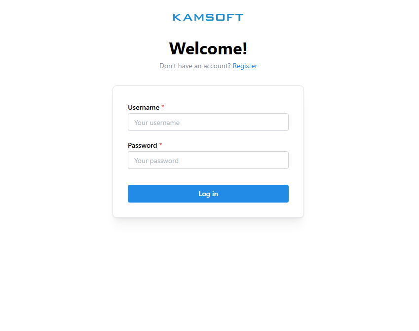
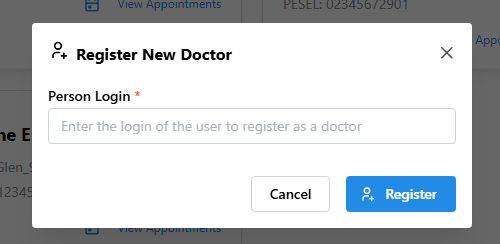
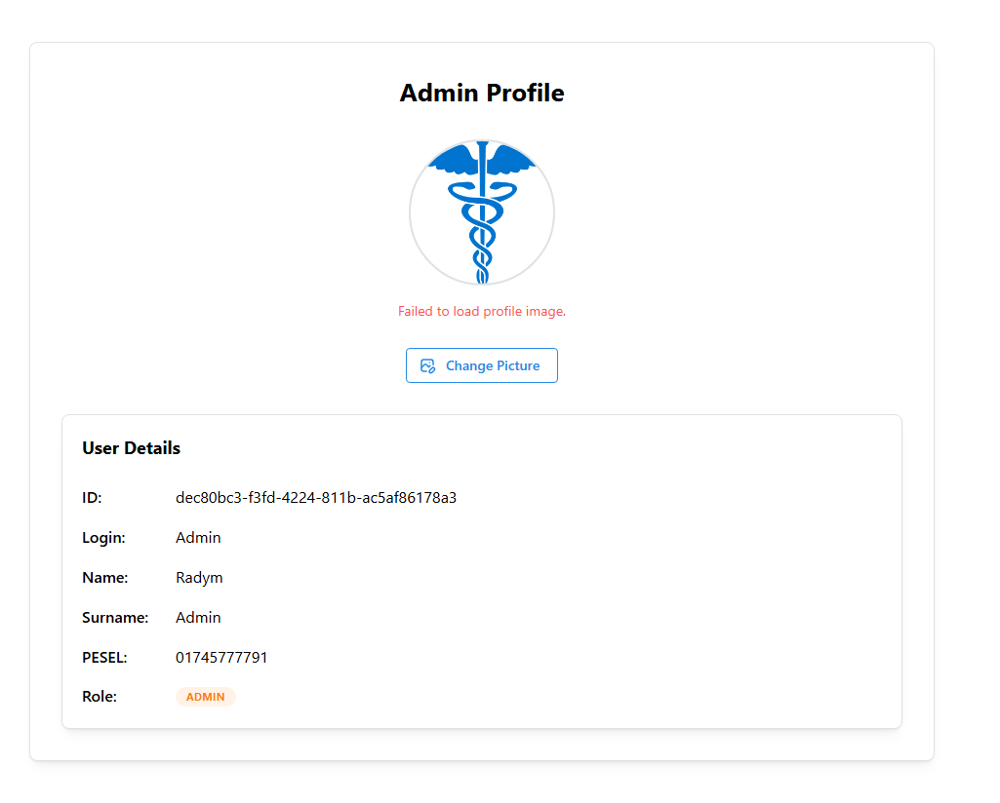
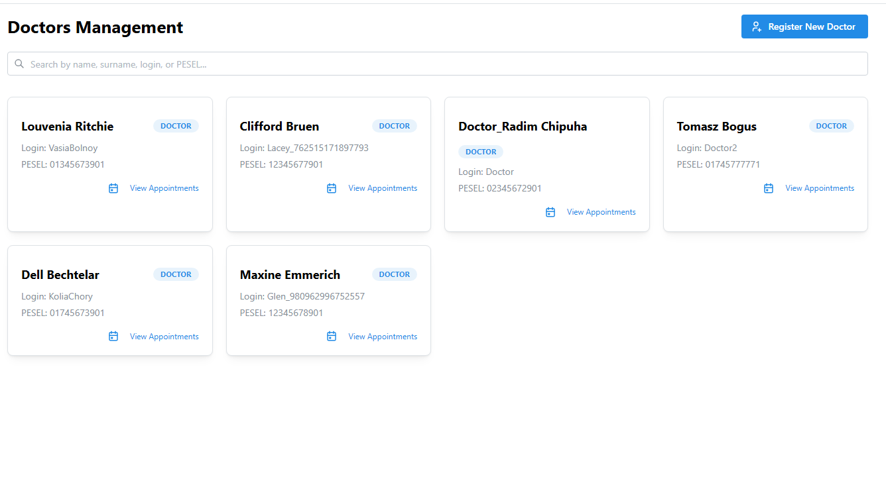
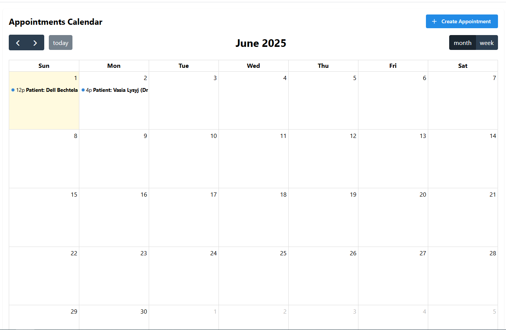
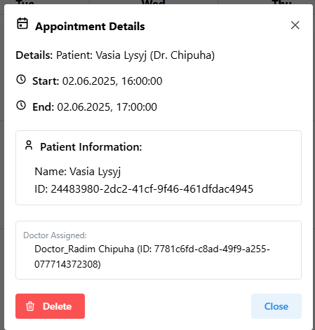
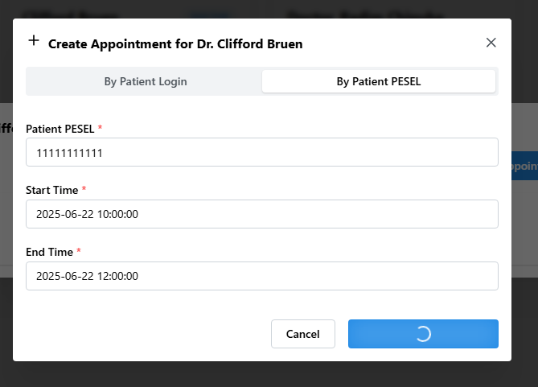
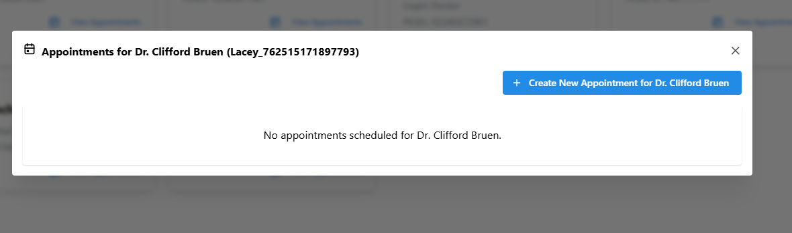
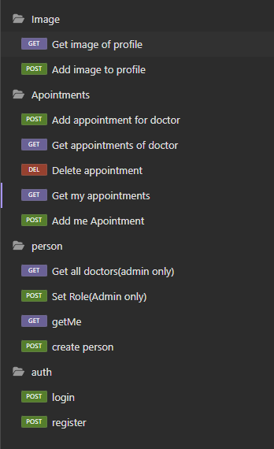

# Hospital

This project was created for educational purposes during an interview process at Kamsoft, aimed at hospital management..

## Table of Contents
- [Prerequisites](#prerequisites)
- [Installation](#installation)
- [Configuration](#configuration)
  - [API](#api)
  - [Frontend](#frontend)
- [Database Setup](#database-setup)
- [Running the Application](#running-the-application)
- [Deployment to AWS](#deployment-to-aws)
- [Features](#features)
- [Screenshots](#screenshots)

## Prerequisites

- .NET SDK (Specify version, e.g., .NET 8.0 or later)
- Node.js and npm (Specify version, e.g., Node.js 16.x or later) - If a frontend is part of this repository
- AWS CLI (If deploying to AWS)
- Docker (Optional, if using containers)

## Installation

1.  **Clone the repository:**
    ```bash
    git clone https://github.com/radimbig/hospital.git
    cd hospital
    ```

2.  **Backend Setup (hospital API):**
    Navigate to the backend project directory (e.g., `hospital`):
    ```bash
    cd kamsoft 
    dotnet restore
    ```
    Next, rename `appsettingsExample.json` to `appsettings.json`. Open `appsettings.json` and fill in your actual configuration values for the database connection, Azure services (Message Bus, Blob Storage), JWT secret key, and any other settings. Replace all placeholder values with your specific details.

3.  **Frontend Setup (if applicable):**
    Navigate to the frontend project directory (e.g., `frontend`):
    ```bash
    cd frontend
    npm install
    ```
    

## Configuration

### API

The API can be configured using Environment Variables for some settings. However, core configurations like database connection, Azure services, and JWT secrets are managed in the `hospital/appsettings.json` file.

Key environment variables:

-   `DISABLE_REGISTRATION`: Set to `true` to disable user registration.
    ```
    DISABLE_REGISTRATION=true
    ```
-   `FRONTEND_URL`: Specifies the allowed origin for CORS (Cross-Origin Resource Sharing) policy. This should be the URL of your deployed frontend application.
    ```
    FRONTEND_URL=http://your-url-frontend.com
    ```

In `kamsoft/appsettings.json`, you will need to configure:
-   **ConnectionStrings**: Your database connection string.
-   **AzureMessageBus**: Configuration for Azure Service Bus.
-   **AzureBlobStorage**: Configuration for Azure Blob Storage.
-   **JwtSettings**: Your secret key for JWT generation and validation, issuer, and audience.

Example structure within `appsettings.json`:
```json
{
  "ConnectionStrings": {
    "DefaultConnection": "Server=your_server;Port=your_port;Database=your_database;User=your_user;Password=your_password;"
  },
  "AzureMessageBus": {
    "ConnectionString": "your_service_bus_connection_string",
    "QueueName": "your_queue_name"
  },
  "AzureBlobStorage": {
    "ConnectionString": "your_blob_storage_connection_string",
    "ContainerName": "your_container_name"
  },
  "JwtSettings": {
    "Secret": "YOUR_VERY_SECURE_SECRET_KEY_HERE_REPLACE_IT",
    "Issuer": "your_api_issuer",
    "Audience": "your_api_audience"
  },
  // ... other settings
}
```
Ensure that `appsettings.json` is included in your `.gitignore` file if it contains sensitive production credentials. For development, you can use `appsettings.Development.json` which overrides `appsettings.json`.

### Frontend

For the frontend application, it's crucial to configure the API endpoint address based on the environment (development/production).

-   Typically, you will have configuration files like `env.debug` for development and `env.production` for production.
-   Ensure the API URL in these files points to the correct backend address. For example:
    -   In `env.debug` (or similar development config): `API_URL=http://localhost:5000/api`
    -   In `env.production` (or similar production config): `API_URL=https://your-deployed-api-domain.com/api`

## Database Setup

This project uses Entity Framework Core for database migrations. To set up or update the database schema:

1.  Ensure your connection string is correctly configured in `kamsoft/appsettings.json` (or `appsettings.Development.json` for local development).
2.  Navigate to the directory containing the `csproj` file of your main backend project (e.g., `kamsoft`).
3.  Run the following command to apply migrations:
    ```bash
    dotnet ef database update
    ```
    If you are running this for the first time, it will create the database and the schema. Subsequent runs will apply any pending migrations.

## Running the Application

### Backend
Navigate to the `kamsoft` directory and run:
```bash
dotnet run
```
The API will typically be available at `http://localhost:5000` or `https://localhost:5001`. Check the console output for the exact URLs.

### Frontend (if applicable)
Navigate to the `frontend` directory and run:
```bash
npm start
```
The frontend will usually be available at `http://localhost:3000`.

## Deployment to AWS

This project is structured to be deployable to AWS, particularly using services like AWS Lambda for the backend and S3 (with CloudFront) for the frontend.

### Backend (API as an AWS Lambda function)

1.  **Configure AWS CLI:**
    If you haven't already, configure your AWS CLI with your credentials and default region:
    ```bash
    aws configure
    ```

2.  **Install Amazon.Lambda.Tools:**
    This .NET Core Global Tool helps in deploying .NET Core Lambda functions.
    ```bash
    dotnet tool install -g Amazon.Lambda.Tools
    ```

3.  **Create a new Lambda project (example):**
    While your existing project can be adapted, this command shows how to create a new .NET Lambda project scaffold. You would typically integrate the Lambda hosting model into your existing API project (e.g., using `Amazon.Lambda.AspNetCoreServer`).
    ```bash
    dotnet new lambda.EmptyFunction --name your-lambda-function-name 
    ```
    Replace `your-lambda-function-name` with your desired function name.

4.  **Deploy your API:**
    Refer to the AWS documentation and the `Amazon.Lambda.Tools` documentation for detailed steps on packaging and deploying your existing ASP.NET Core application as a Lambda function. This often involves adding a Lambda entry point to your application and using a command like `dotnet lambda deploy-serverless`.

### Frontend (Static Site Hosting on S3)

1.  **Build your frontend for production:**
    Navigate to your `frontend` directory and run:
    ```bash
    npm run build 
    ```
    This will typically create a `build` or `dist` folder with static assets.

2.  **Upload to S3:**
    -   Create an S3 bucket.
    -   Configure the bucket for static website hosting.
    -   Upload the contents of your frontend's `build` (or `dist`) folder to the S3 bucket.
    -   Consider using AWS CloudFront for HTTPS, caching, and global distribution.

## Features

This API provides a comprehensive set of features for managing a hospital or clinic environment. Key functionalities are exposed through the following controllers:

### Core Functionalities:

🔑 **Authentication (`AuthController`):**
*   User registration with login and password.
*   Secure user login returning JWT (JSON Web Tokens) for session management.
👥 **User & Person Management (`PersonController`):**
*   User self-registration (after initial credential setup via `AuthController`).
*   Retrieval of the currently authenticated user's profile (`/me`).
*   Role management: Admins can assign roles (e.g., Admin, Doctor, Patient) to users.
*   Listing of users by role (e.g., retrieve all doctors).
📅 **Appointment Scheduling (`AppointmentController`):**
*   Admins can create appointments, assigning a patient to a doctor for a specific time slot.
*   Doctors and Patients can view their upcoming appointments.
*   Doctors can create appointments for their patients.
*   Admins and the assigned Doctor can cancel/delete appointments.
🖼️ **Profile Image Management (`ImageController`):**
*   Users (Admin, Doctor, Patient) can upload and manage their profile pictures.
*   Retrieval of user profile images.

### Technical Highlights:

🧩 **CQRS with MediatR:** Utilizes the Command Query Responsibility Segregation pattern via the MediatR library for clean and maintainable business logic.
🛡️ **Input Validation:** Implements request validation (e.g., for appointment times, counts) to ensure data integrity and provide clear error feedback.
🔒 **Role-Based Authorization:** Secures endpoints based on user roles (Admin, Doctor, Patient), ensuring users can only access appropriate functionalities.
🔄 **AutoMapper:** Simplifies object-to-object mapping (e.g., entities to ViewModels).
☁️ **Azure Integration:**
*   **Azure Blob Storage (`ImageController`):** Leverages Azure Blob Storage for persisting and serving user profile images efficiently.
*   **Azure Queue Storage (`AppointmentController`):** Uses Azure Queue Storage for asynchronous processing of appointment-related events (e.g., creation, deletion notifications).
🔗 **Dependency Injection:** Makes extensive use of dependency injection for loosely coupled and testable components.
⚡ **Asynchronous Operations:** Employs `async/await` for non-blocking I/O operations, enhancing performance and scalability.
🛠️ **Admin Console Panel (`AdminPanel`):**
*   A separate console application (`AdminPanel/Program.cs`) is provided for administrative tasks.

*(The `TempController` appears to be for development or testing purposes, providing basic CRUD operations on Person entities.)*

## Screenshots

Below are some screenshots showcasing the application's interface and functionality:

**Login Page:**


**Registration Modal:**


**User Profile Page:**


**Appointments Management (Admin/Doctor View):**


**My Appointments Page (Patient/Doctor View):**


**Appointment Details:**


**Create Appointment Form:**


**General Capture (Possibly API related or other view):**


**API Endpoint Example :**



---

